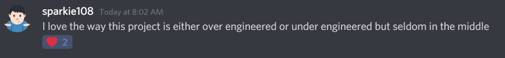

# Trains.NET

## Play the Blazor version in your browser!
# [https://wengier.com/Trains.NET](https://wengier.com/Trains.NET)

### Info

Developed live on stream at [https://www.twitch.tv/davidwengier](https://www.twitch.tv/davidwengier) at 8:30pm Wednesdays from [Melbourne, Australia](https://www.timeanddate.com/worldclock/australia/melbourne).

Videos available on YouTube at [http://bit.ly/trains-net-videos](http://bit.ly/trains-net-videos).

Join the Discord at [https://discord.gg/Yt5B58b](https://discord.gg/Yt5B58b)

### Background

Trains.NET is based on Trains originally created by James Formica, Scott Holden and David Wengier.

Trains is available to play online at https://jamesformica.github.io/trains (Mirror at https://wengier.com/trains if that doesn't work).

Trains2 is a fork of Trains that I started in order to clean up some things and add some features I wanted. It's available to play online at https://wengier.com/trains2 but you might be hard pressed to find the differences (hint: what happens when two trains are heading towards the same crossing).

Trains.NET is a complete re-write, from scratch, in .NET Core and C#, using SkiaSharp for drawing, because I like .NET Core and C# more than I like TypeScript. Most development happens live on Twitch, but if there is anything you see and aren't sure about, and can't find (or can't be bothered finding!) the stream to see why things are that way, feel free to ask about it.

### Testimonials

### Get Involved

Comments, suggestions, questions, feature requests, stream requests etc. are all very _very_ welcome, simply file an issue on this repository, or ask in the Discord.

#### Development Quick Start Guide

- Clone the [Trains.NET](https://github.com/davidwengier/Trains.NET) repository
- Open the project in Visual Studio 2019 (or similar IDE)
  - NOTE: You will probably need the latest preview version of Visual Studio to work on this, but command line builds through `dotnet build` should always work
- Start debugging to confirm it works
